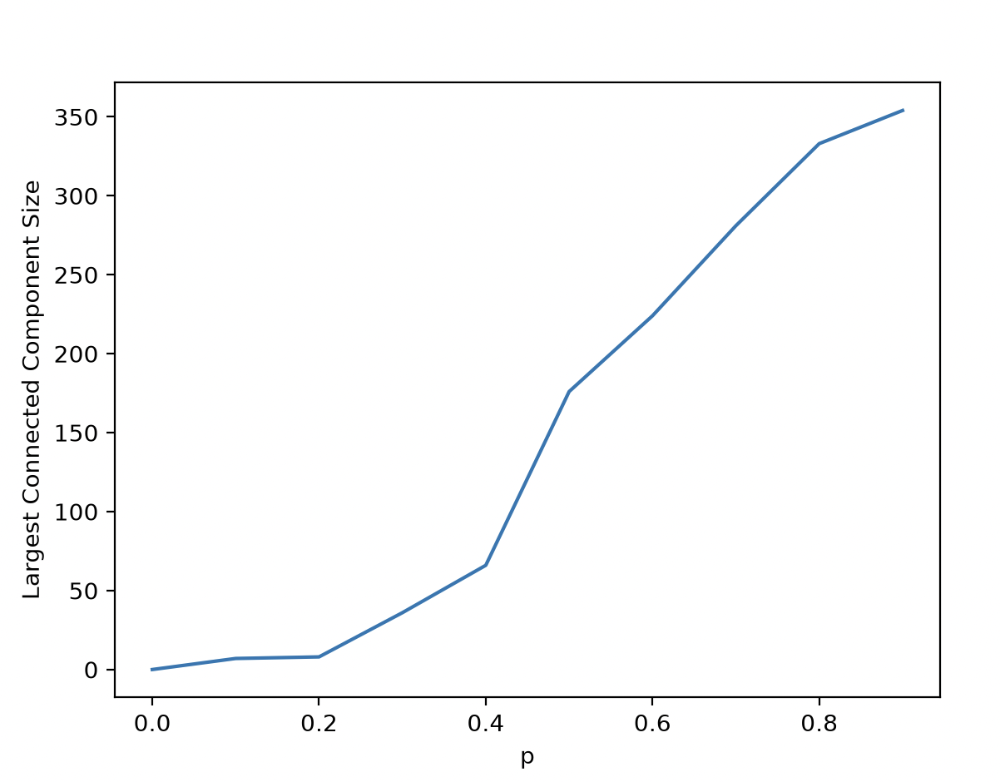

## The Problem

>Write a short computer code to visualize the percolation transition.  
>Initialize a two-dimensional 20 x 20 lattice and have every site occupied with probability p. 
>Vary p from zero to one in steps of 0.1. 
>For each realization count the size of the maximum cluster, Cmax, and plot it versus p.

## Approach

1. Generate a 20 x 20 2D array, fill in positions as 0 or 1, with a `p` probability of the position being 1
2. Run a BFS starting at each position that is `1`, but not repeating a search if a position has already been visited.
    - The BFS uses the assumption that each position is a node. Each node is connected vertically, horizontally, and diagonally.
3. Keep track of the size of the largest component
3. Repeat the above for different values of `p` and plot Component Size vs `p`

## Discussion

From my observations, the percolation threshold appears to be somewhere between 0.4 and 0.5. This is when the graph spikes.  
It appears somewhat jagged, but running more tests for each specific `p` value and averaging would likely yield something more smooth.    
One important realization I had while doing this project was that lists are horribly inefficient. I hadn't run into this problem before, but as the percolation threshold was crossed and the size of the largest component increased, the queue and visited set in the Breadth-First-Search algorithm became very large and slow to access. I ended up switching them to actual queue and set data structures.

