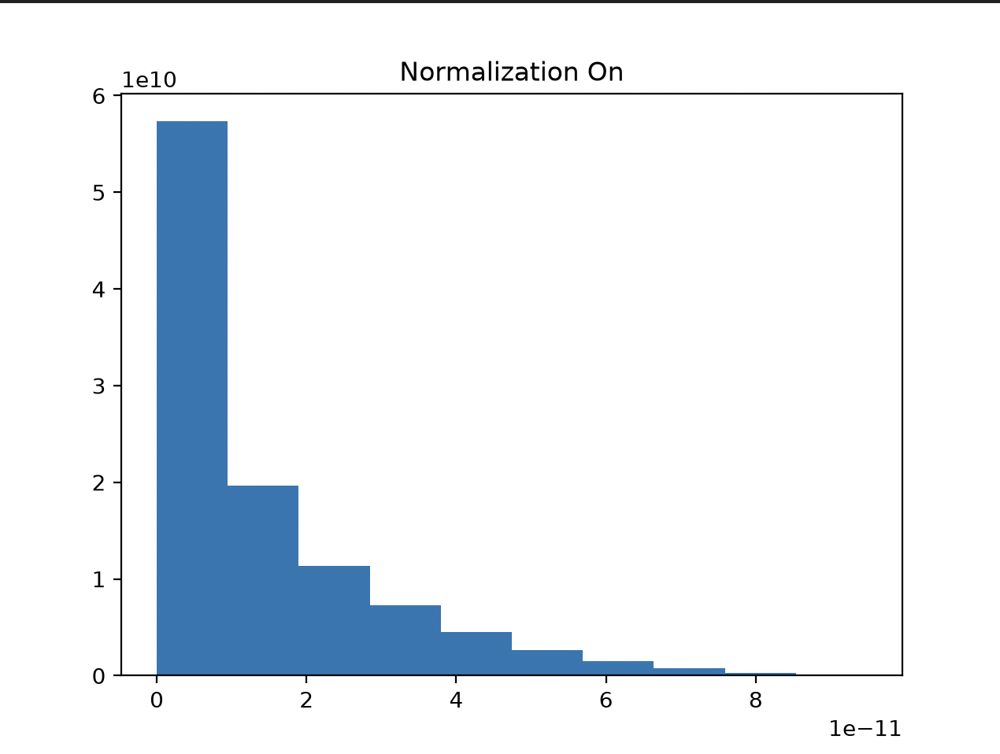
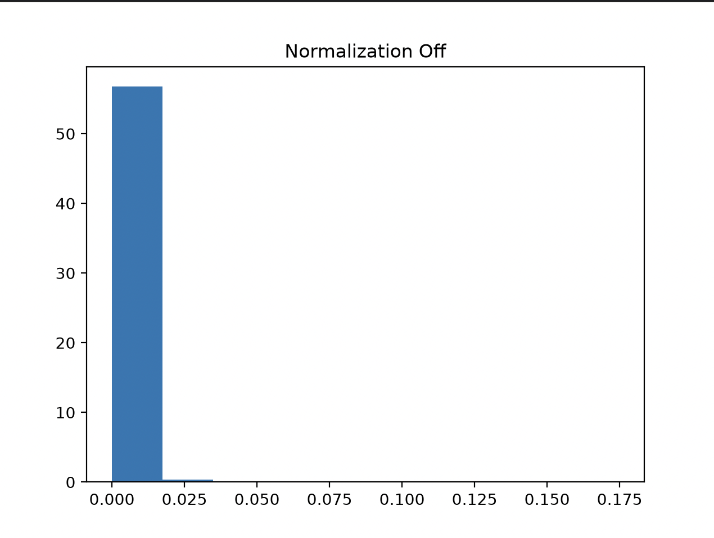

## The Problem
> Write a short computer code that produces distribution functions for ten  products of uniformly distributed random numbers over the interval between 0 and 1. What distribution function do you expect? 
> Next, compute distribution functions for ten products of random numbers as before, but normalize them; in other words, enforce that the sum of the ten numbers is always 1. What distribution do you expect?

## Hypotheses
**Uniformly Distributed between 0 and 1**
I would expect a distribution function heavily spiked near 0 with essentially no tail. Multiplying values between 0 and 1 together will create smaller numbers that approach 0

**Uniformly Distributed and Normalized**
I would expect a more diverse distribution. Extremely small values are less likely to bring the product to zero if they are normalized.

## Discussion and Results

The hypotheses turned to be somewhat accurate. The unnormalized distribution was almost entirely at zero, whereas the normalized distribution had a spike at zero but with an additional, fatter, tail.

