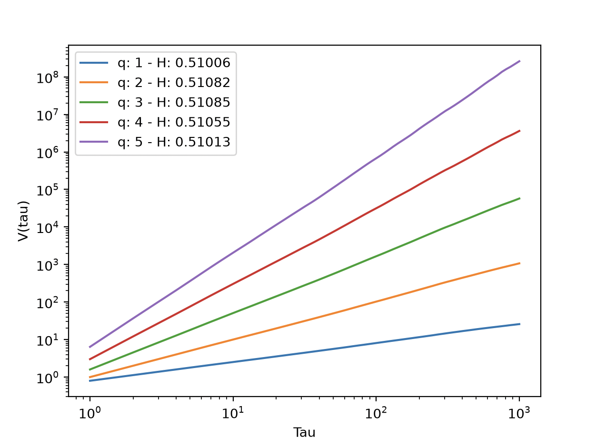

## The Problem
>Write a short computer code that generates the time series $x_{t+1} = x_t+ ξ_t$,  where ξ_t is a random number from a Gaussian distribution with zero mean and unit variance.  
>Generate 100,000 iterations.  
>Try to plot V as a function of τ as defined in Equation (3.56). What does H(q) look like? Plot it for a few values of q. 

> Equation 3.56: $V(\tau)=\langle | x_{t+\tau}-x_t|^q \rangle_t \sim \tau^{qH(q)}$ 

## Process

### Finding H(q)
$V(\tau) \sim \tau^{qH(q)}$  
$ln(V(\tau))\sim ln(\tau^{qH(q)})$  
$\frac{ln(V(\tau))}{ln(\tau)} \sim qH(q)$  

So the slope of a loglog graph of $V(\tau) \text{ vs }\tau$, divided by $q$, would yield $H(q)$

### Getting $V(\tau)$
More details are in the code comments, but essentially, I calculate $\langle | x_{t+\tau}-x_t|^q \rangle_t$ for multiple different values of $\tau$.  
I can then fit the data on a logarithmic scale to extract the slope. I do this for multiple different values of $q$.

## Discussion

As expected, for all examined values of q, $H(q) \sim \frac{slope}{q} \approx 0.5$  
This is expected because the time series is generated by randomly drawing from a normal distribution. The variation of `H(q)` (the Hurst exponent) across different `q`s implies that the size of fluctuations are relevant to how the system responds.   
If `H(q)` varies, the system is called *multifractal*. If it doesn't, it means that large fluctuations and small fluctuations have similar effects on the system, and it is *monofractal*  
$H(q) > 0.5$ implies that the system is self-reinforcing at a given level; an increase will follow an increase, a decrease will follow a decrease  
$H(q) <0.5$ implies that the system is *negatively* reinforcing at a given level; an increase will raise the likelihood of a decrease in the next time step, and vice versa.  
$H(q) = 0.5$ implies that the system is *completely random*. Which is what we have here, and what is clear from the simulation.

