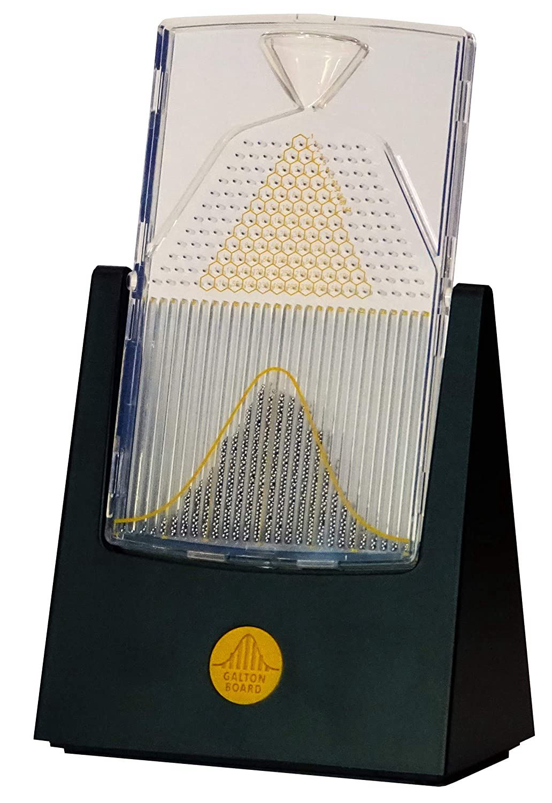
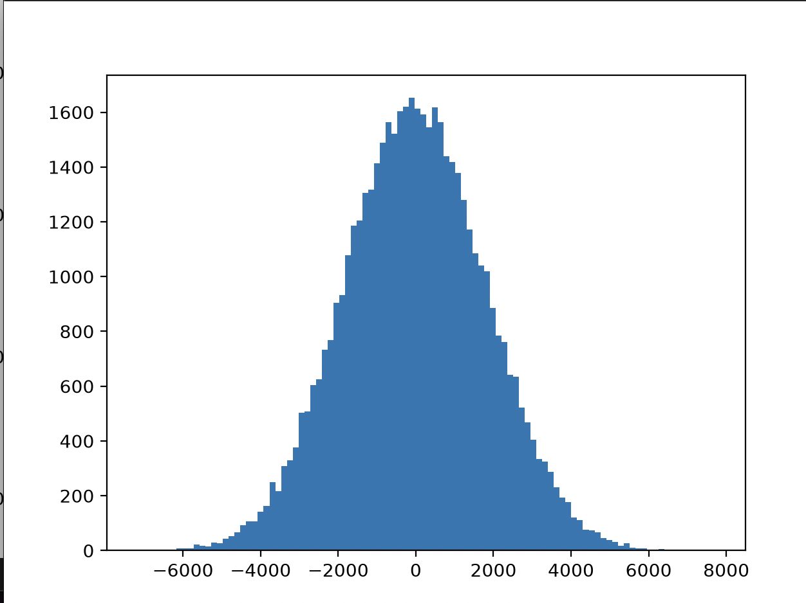
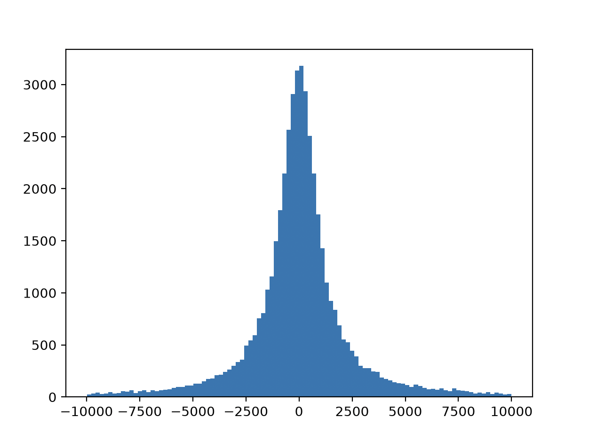
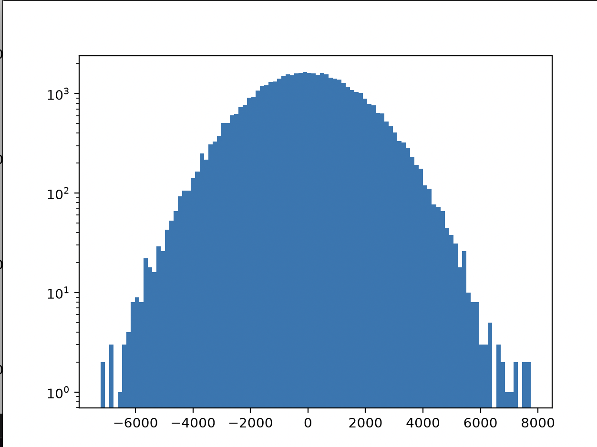
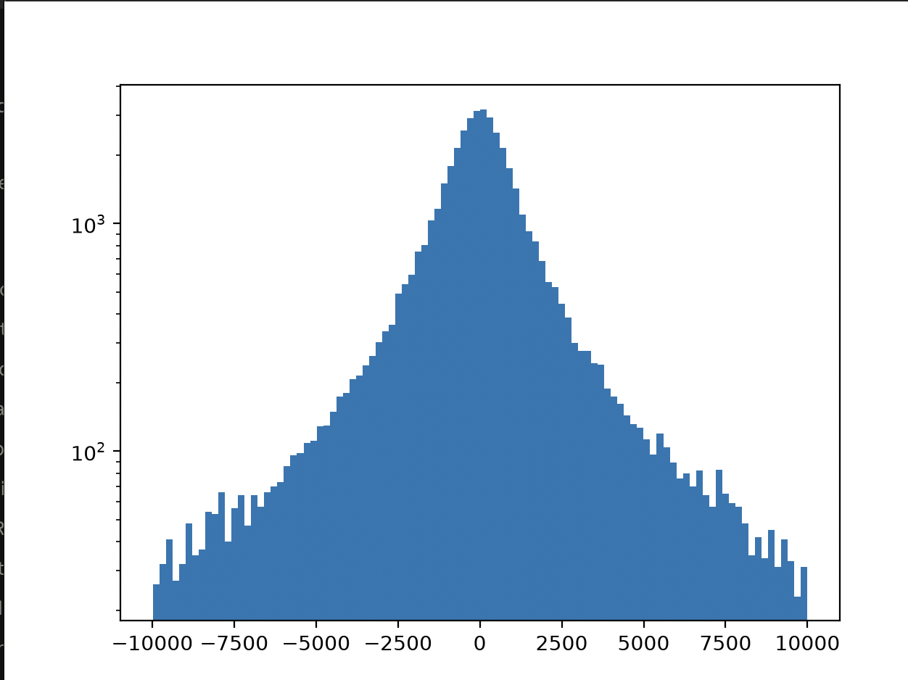

# Week 1 Project - Random Walk

## Reading
- ITCS Chapter 2: Probability
- LP Chapter 1: Introduction

## Background
This is the project for Week 1. It complements the completion of Chapter 2 of Thurner's textbook, which is on probability and stochastic processes.

One of the key ideas in the probability chapter was the **Central Limit Theorem (CLT)**. Essentially, for (nearly) any distribution of random variables, a new random variable equivalent to the sum of their results from a number `N` of trials, will take the form of the Gaussian (or normal) distribution.

Put concretely, a random variable `Y` such that $Y = \sum_{n}^{N}X(n)$ will take on a normal distribution for (nearly) any random variable `X` and sufficiently large `N`.

This is why those bead dropping toys always seem to take on the shape of a mound.

However, note how I keep saying "nearly". This is because the CLT only applies if the random variable `X` has a *finite mean and variance*. This isn't the case in some distributions, like the Cauchy distribution or certain power law distributions.

## The Project

To examine this theorem and implement it myself, I built a very simple *random walk*. It has two modes: standard and cauchy.
In the standard mode, the size of the increment is drawn from a uniform distribution (python random module), whereas the cauchy mode draws increments from a standard cauchy distribution (thanks numpy).

Each walk (trial) starts at (0,0), and the y-axis increments by some random amount. Each step during the trial is essentially a sample from `X(n)`, and the final y-position is a sample from $Y = \sum_{n}^{N}X(n)$.

After enough trials are made, a histogram of final y-positions is visualized. In theory, the trials drawing from a uniform distribution should produce a histogram with a normal distribution, whereas the trials drawing from a standard Cauchy distribution should yield a histogram with a fat-tailed distribution.

There are two primary parameters that need to be determined: the number of steps per run `N` and the total number of trials `s`. If `N` is too small, then the CLT will not apply because the sum does not consist of enough values. If `s` is too small, then the histogram will be basically flat and not very helpful.

## Results

The results match what is expected. The trials drawing from a uniform distribution for increments appear to produce a Gaussian shape, and the trials drawing from a Cauchy distribution have a spike in the middle.

*Why does the Cauchy distribution have a spike?*
In both the uniform and Cauchy case, increments are equally likely to be either positive or negative, so they often cancel each other out and produce a distribution centered at 0. However, the Cauchy distribution is more likely to draw extreme values. So in the case where, nearing the end of a trial, a few large samples are made and the final endpoint is skewed far from 0, extreme values are observed. This is why the tail of the histogram for the Cauchy case is so long.

Moreover, if the y-axis is switched to a log scale, it can be seen that the histogram for the Cauchy case falls off linearly, whereas the histogram for the uniform case falls off as a parabola. This is to be expected; fat-tailed distributions fall off *more slowly* than normal distributions.

