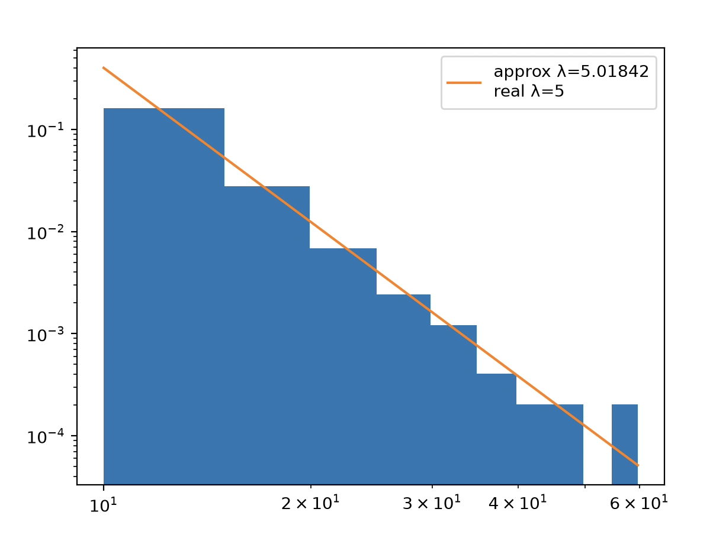

# Week 2 Project - Power Law

## Reading
- ITCS Chapter 3: Scaling
- LP Chapters 2 through 4: Simplex, Degeneracy, Simplex Efficiency

## Background
This is the project for Week 2. It complements the chapter on power laws and scaling in the complexity textbook

## The Project

The aim of this project was to generate a series of values drawn from a *General Pareto Distribution*, plot the histogram, and attempt to determine the power law used in the distribution by just examining the histogram. This power law could then be fitted onto the histogram to observe the accuracy of the approximation.

The chapter discussed "maximum likelihood", which is a method of determining the exponent used in a power law through Bayes's Rule. It finds the exponent with the maximal probability of yielding the given values.

## Maximum Likelihood

The general Pareto distribution is given by $p(x) = \frac{a-1}{x_m}(\frac{x}{x_m})^{-a}$ 

This means that the probability of a specific histogram of random variables $\vec{x}$ occurring given a specific $a$ is $p(\vec{x}|a)=\prod_{i=1}^N \frac{a-1}{x_m}(\frac{x_i}{x_m})^{-a}$ 

Bayes's Rule says $p(a|\vec{x})=p(\vec{x}|a)\frac{p(a)}{p(\vec{x})}$ 
With no other information we can assume an equal likelihood for all $p(a)$, so it can be replaced by a constant. $p(\vec{x})$ is also essentially a normalizing constant, so the fraction can be replaced with a constant $c$

So $p(a|\vec{x}) =\prod_{i=1}^N \frac{a-1}{x_m}(\frac{x_i}{x_m})^{-a}$, and taking the logarithm of both sides and simplifying gives
$l(a) = log(p(a|\vec{x})) = N(log(a-1)-log(x_m)(a-1))-a\sum log(x_i)$ 

To find `a` with the maximum probability, we find the maximum of this function. This can be done by differentiating and setting equal to 0 (to find where the slope is zero). This gives
$$
a=[\frac{\sum log(x_i)}{N}-log(x_m)]^{-1}+1
$$

Which can be solved with a function.

## Results

The strategy of maximum likelihood seems to work well. The fit line generally matched with the normalized histogram.

