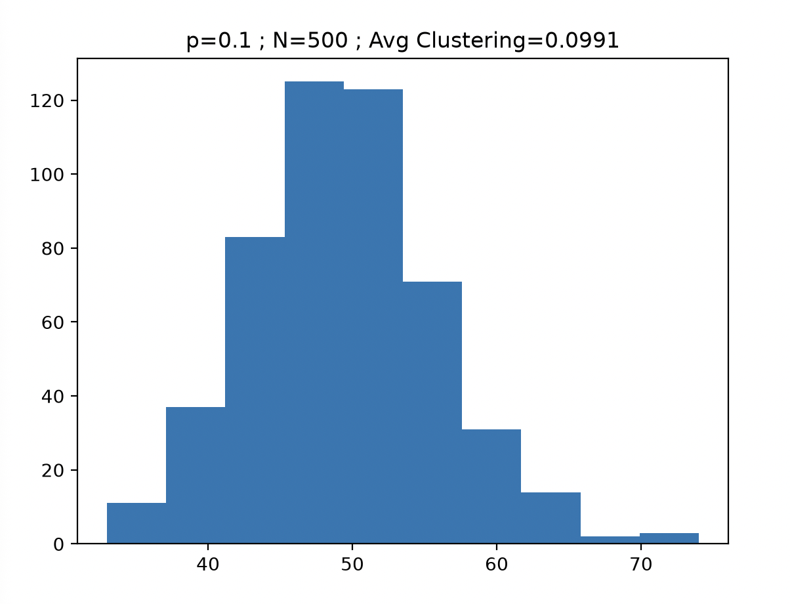
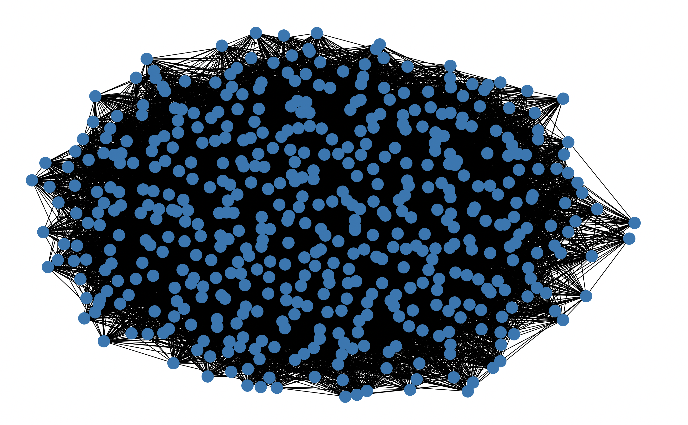
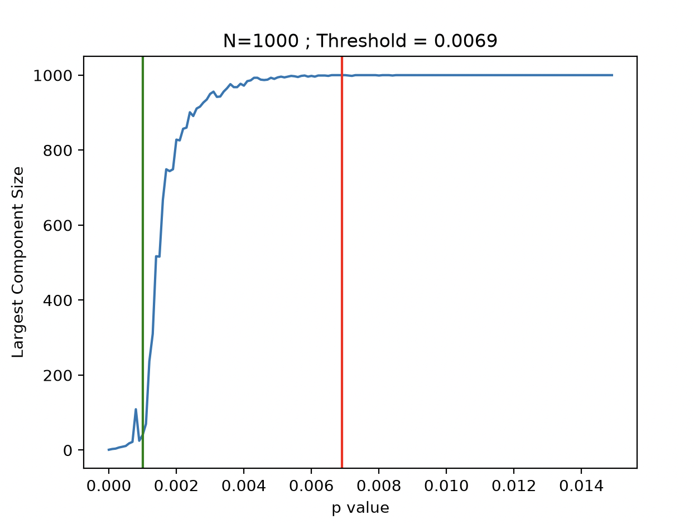

# Week 3 Project - Erdos-Reyni

## Reading
- ITCS Chapter 4 *4.1 through 4.4*: Networks
- LP Chapter 5: Duals

## Background

Erdos-Reyni (ER) graphs/networks are a special type of random network characterized by a number of nodes $N$ and a specific probability $p$. $p$ denotes the probability that an edge exists between a pair of nodes.
ER networks are special because they have some very interesting properties that emerge from the values of $N$ and $p$.

Some examples are:

- The *average clustering coefficient* of the graph is equivalent to $p$.
    - The clustering coefficient of a node $i$, $C_i$, is the probability that two nodes attached to $i$ are also attached to one another. Essentially, it is the probability that node $i$ is in a triangle
    - Average clustering coefficient is just the average of all individual clustering coefficients

- When $N*p$ < 1, the graph has no significantly large connected components
- When $N*p$ = 1, a giant component emerges
- The degree distribution is binomial

## The Project

This project had three main components (get it?): 
- Generate an ER network using Network X
- Plot the degree distribution
- Calculate the clustering coefficient

NetworkX has an `average_clustering` function, but for the sake of getting a better understanding of the mathematics, I wrote a custom `get_avg_clustering` function that uses the formula from the textbook. After some testing, for all statistical purposes, my function and the NX function yield equivalent values.

### Calculating Clustering Coefficient

There's a theorem that states that the adjacency matrix of a graph, raised to the n'th power ($A^n$), shows the number of walks of length 'n' that exist between the vertices in the adjacency matrix. 

A triangle of three nodes implies that there is a walk of length 3 from one of those nodes to itself. There are $A^n_{ii}$ walks of length n from a node $i$ to itself.

If a node has degree $k_i$, then it has $k_i(k_i-1)$ possible ordered pairs of neighbors.

Therefore, the probability that a node is in a triangle (i.e., its connectivity), is given by $C_i=\frac{A^3_{ii}}{k_i(k_i-1)}$

The average clustering coefficient is just $C_{avg}=\frac{1}{N}\sum_{i}C_i$

## Results

Below are images of a run with $N=500$ and $p=0.1$.

As is seen, the average clustering coefficient is nearly equivalent to $p$. With more tests, the average would almost certainly come out to 0.1.

The degree distribution is also noticeably binomial in appearance. The logic behind this is that the process of creating edges is essentially a Bernoulli process (flip a biased coin with probability $p$ of success). We know that Bernoulli processes yield binomial distributions.

The threshold of complete graph connectedness for an ER graph is given by $p = \frac{log(N)}{N}$. To test this, I retrieved the size of the largest component for a series of graphs with varying $p$ and constant $N=1000$. I then plotted these.

You can see that, at the threshold (the red line), the size of the largest connected component stays constant at 1000 (every single node is connected).
The green line shows where $N*p=1$, and is where a giant component first begins to emerge in the graph.

