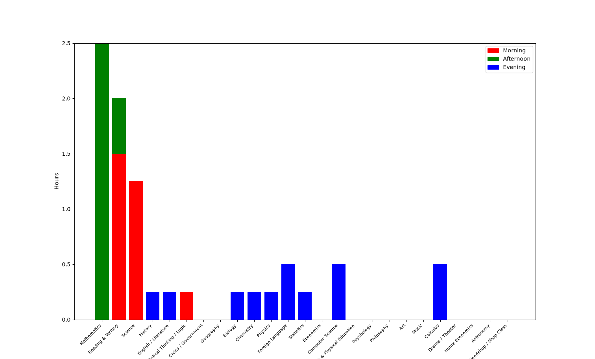

# Week 4 Project - Resource Allocation Problem

## Reading
- ITCS Chapter 4 *4.4 through 4.7*: Networks
- LP Chapter 7: Sensitivity Analysis

## Background

One of the primary usecases of Linear Programming is in *resource allocation* problems. These are problems where some objective, dependent on the amount of each allocated resource, is to be maximized, while operating under availability constraints for each resource.
For example: maximizing profit at a factory. More output leads to greater profit, but output is dependent on resources such as materials, labor, investment etc.

Linear Programming also allows for *sensitivity analysis*, which is analyzing how modifying different components of the objective function or constraints impacts the optimal value and resource allocations.
A specific element of sensitivity analysis is *shadow prices*, which are the optimal variables in the *dual LP*. Each constraint has a shadow price that indicates how the best possible objective value change if the constraint was relaxed.


## The Project

This is a resource allocation problem that serves to determine how a student should allocate their study hours per day.

Moreover, it determines different portions of the day to be more productive. The afternoon is most productive, the morning is somewhat productive, and the evening is least productive.

*Objective*: Maximize total performance. Performance in a subject is determined by the product of that subject's *priority* and the amount of time spent studying it

*Constraints*:
- Each subject $s$ must meet a unique minimum time $m_s$
- Each subject must remain below its maximum time $d_s$ (diminishing returns)
- The total time across all subjects must remain below $T$
- Certain subjects have *prerequisites*. If time in subject $i$ is spent, and $i$ is dependent on $j$, then time must be spent in $j$
- The time spent in one time chunk must not exceed $T/3$

### Mathematical Formulation

**Objective Function**

Let $w_{st} = p_se_t$
Where $e_t$ is the *energy multiplier* for time of day $t$, and $p_s$ is the priority for subject $s$

Let $x_{st}$ be the amount of time spent in subject $s$ at time of day $t$

$Z=\sum_t(\sum_s w_{st}x_{st})$

**Individual Subject Max and Min**

For all $s$
$\sum_t x_{st} >= m_s$
$\sum_t x_{st} <= d_s$

**Total Max Time**

$\sum_t(\sum_s x_{st}) <= T$

**Time Chunk Constraint**

$\sum_s x_{st} \le \frac{T}{3} \space \forall{t}$ 

**Prerequisite Constraint**

This is where it gets slightly complicated. A *binary decision variable* needs to be introduced.

This binary decision variable $y_s$ is $=1$ when any time has been spent in subject $s$. We achieve this by making a *big-M constraint*.

$\sum_tx_{st}\le My_s \space \forall s$ 

Then the matter of making sure time was spent in subject $j$ if $j$ is a prereq for $i$ is just

$y_s \le y_j \space \forall \text{j such that j is a prereq for i}$ 

## Results
**Optimal Value**
This number is not based in any science, so it's a bit meaningless, but the optimal value is **165.75 performance units**

**Time Allocation**
The optimal schedule is attached at the bottom of this file, and a visualization is below.

The results make sense. The heaviest hitters (greatest priority) are placed in the Afternoon to maximize their usefulness.

The less useful subjects, like Calculus, are pushed to the Evening to satisfy their minimal constraint while not taking time away from the subjects with greater priority.



**Shadow Prices**

The shadow prices (shown below) reveal the most pertinent constraints in the problem: how much time can be spent in one time slot. Compared to the minimum and maximum constraints, limiting how much time can be spent in one portion of the day is the most detrimental for performance.

For instance, if we allowed just 1 more hour in the afternoon, we could get an extra 28 units of performance.

Relaxing the minimums on certain subjects also appears to be productive. Reducing the minimum study time for calculus by 1 hour would increase performance by 6 units, likely since more time could be spent on higher priority subjects.

```
Mathematics_max: 2.0
Reading_&_Writing_max: 2.0
History_min: -2.0
English_/_Literature_min: -2.0
Critical_Thinking_/_Logic_min: -2.0
Biology_min: -3.0
Chemistry_min: -3.0
Physics_min: -3.0
Foreign_Language_min: -3.0
Statistics_min: -4.0
Computer_Science_min: -4.0
Calculus_min: -6.0
slot_budget_morning: 18.0
slot_budget_afternoon: 28.0
slot_budget_evening: 10.0
```


## Optimal Schedule
```
morning :
Mathematics: 0.0h
Reading & Writing: 1.5h
Science: 1.25h
History: 0.0h
English / Literature: 0.0h
Critical Thinking / Logic: 0.25h
Civics / Government: 0.0h
Geography: 0.0h
Biology: 0.0h
Chemistry: 0.0h
Physics: 0.0h
Foreign Language: 0.0h
Statistics: 0.0h
Economics: 0.0h
Computer Science: 0.0h
Health & Physical Education: 0.0h
Psychology: 0.0h
Philosophy: 0.0h
Art: 0.0h
Music: 0.0h
Calculus: 0.0h
Drama / Theater: 0.0h
Home Economics: 0.0h
Astronomy: 0.0h
Woodshop / Shop Class: 0.0h


afternoon :
Mathematics: 2.5h
Reading & Writing: 0.5h
Science: 0.0h
History: 0.0h
English / Literature: 0.0h
Critical Thinking / Logic: 0.0h
Civics / Government: 0.0h
Geography: 0.0h
Biology: 0.0h
Chemistry: 0.0h
Physics: 0.0h
Foreign Language: 0.0h
Statistics: 0.0h
Economics: 0.0h
Computer Science: 0.0h
Health & Physical Education: 0.0h
Psychology: 0.0h
Philosophy: 0.0h
Art: 0.0h
Music: 0.0h
Calculus: 0.0h
Drama / Theater: 0.0h
Home Economics: 0.0h
Astronomy: 0.0h
Woodshop / Shop Class: 0.0h


evening :
Mathematics: 0.0h
Reading & Writing: 0.0h
Science: 0.0h
History: 0.25h
English / Literature: 0.25h
Critical Thinking / Logic: 0.0h
Civics / Government: 0.0h
Geography: 0.0h
Biology: 0.25h
Chemistry: 0.25h
Physics: 0.25h
Foreign Language: 0.5h
Statistics: 0.25h
Economics: 0.0h
Computer Science: 0.5h
Health & Physical Education: 0.0h
Psychology: 0.0h
Philosophy: 0.0h
Art: 0.0h
Music: 0.0h
Calculus: 0.5h
Drama / Theater: 0.0h
Home Economics: 0.0h
Astronomy: 0.0h
Woodshop / Shop Class: 0.0h


Totals
----------
Mathematics: 2.5h
Reading & Writing: 2.0h
Science: 1.25h
History: 0.25h
English / Literature: 0.25h
Critical Thinking / Logic: 0.25h
Civics / Government: 0.0h
Geography: 0.0h
Biology: 0.25h
Chemistry: 0.25h
Physics: 0.25h
Foreign Language: 0.5h
Statistics: 0.25h
Economics: 0.0h
Computer Science: 0.5h
Health & Physical Education: 0.0h
Psychology: 0.0h
Philosophy: 0.0h
Art: 0.0h
Music: 0.0h
Calculus: 0.5h
Drama / Theater: 0.0h
Home Economics: 0.0h
Astronomy: 0.0h
Woodshop / Shop Class: 0.0h
```

