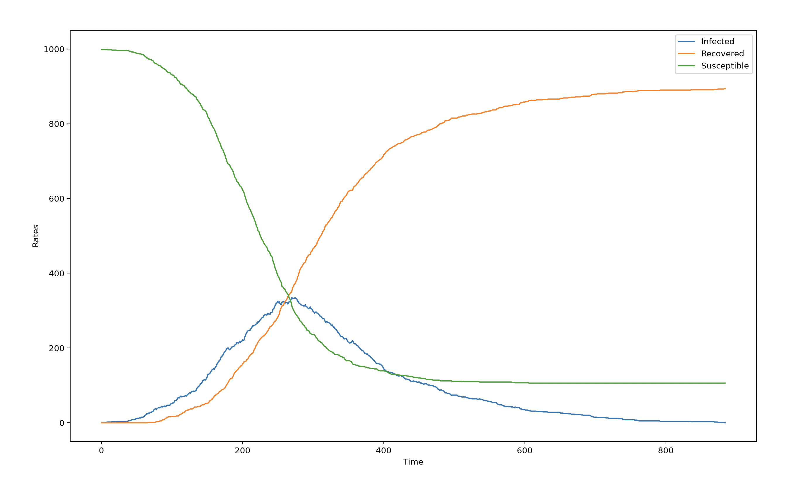
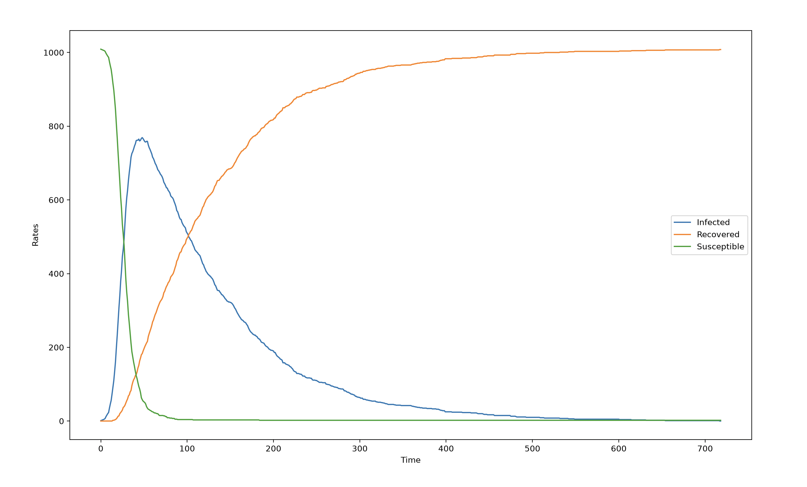

# Week 5 Project - SIR Model

## Reading
- ITCS Chapter 4 *4.4 through 4.8*: Networks
- LP Chapters 7, 10: Sensitivity Analysis and Convex Analysis

## Background

Epidemic spreading models on graphs can provide insight into how networks should be structured as to prevent a disease or virus from infecting the entire population.

One popular epidemic spreading model is the SIR (Susceptible, Infected, Recovered) model.

In this model, at each time step, all infected nodes have a probability $\lambda$ of infecting their neighbors. Simultaneously, any infected node has a probability $\sigma$ of recovering. Once a node is recovered, it cannot be infected again.

Some models also introduce an immunization probability $\pi$. Meaning, before the epidemic begins, each node is immunized (cannot be infected) with probability $\pi$

## The Project

This project is to plot the rates of S, I, and R over time for an ER graph (developed in week 3) and a Barabasi-Albert Graph (new)

A Barabasi-Albert graph is one where nodes are joined by *preferential attachment*, creating a scale-free distribution with hubs. In theory, this means that such graphs are extremely prone to epidemic spreading. In fact, if the exponent of the power law for the network is $\le 3$, the epidemic threshold (threshold for $\lambda$ by which the majority of the graph is infected) does not exist. The graph will always end up majority infected.

Aside from the main project:
- I implemented a *basic reproductive number* calculator, which represents the average number of number that will get infected from one infectious agent. It is dependent on the infection rate, recovery rate, and average node degree in the graph.
    - Because my rates are actually *probabilities*, I used the Poisson distribution to calculate the rate based on the probability of an event occuring in a given time step and solved for $\lambda$: $p = 1 - e^{\lambda \Delta t}$
- I implemented a *critical infectious fraction* calculator for the basic SI that uses the immunization rate and probability of infection in order to determine the fraction $q$ of nodes that will finally be infected
    - Because $q$ is dependent on $q$ itself, I needed to use scipy.fsolve
    - $q = 1 - e^{-(N-1)p(1-\pi)q}$

The parameters I used were as follows:

*SIR Parameters*

$\pi = 0$

$\lambda = 0.01$

$\sigma = 0.01$

*ER Network Parameters*

$N_{er} = 1000$

$p_{er} = 0.005$

*BA Network Parameters*

$m_{B} = 10$

## Results

The results are as expected. The ER graph did not gather as many infected nodes before recovery rates began to dominate. This is why the "infected" curve is just a small bump.

In comparison, the BA graph had a large spike in infections and a gradual dropoff as recovery began to kick in. Even with identical SIR parameters, the $R_0$ for the BA graph was about 4x than that of the ER graph

*ER Graph SIR Curves $R_0 = 4.98$*

*BA Graph SIR Curves $R_0 = 19.4$*

