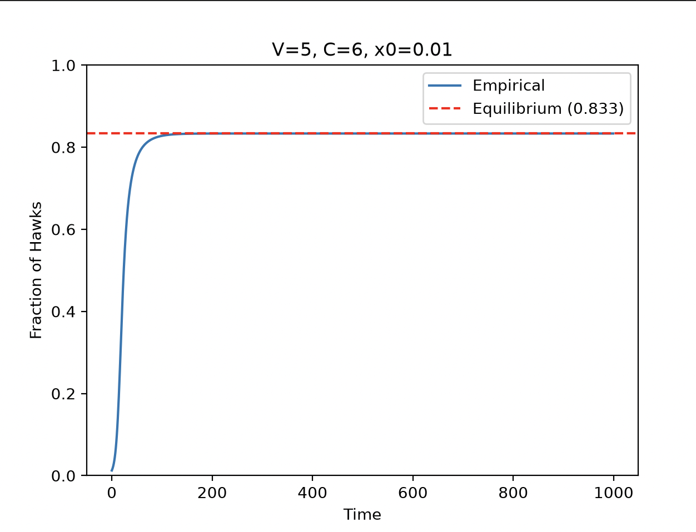
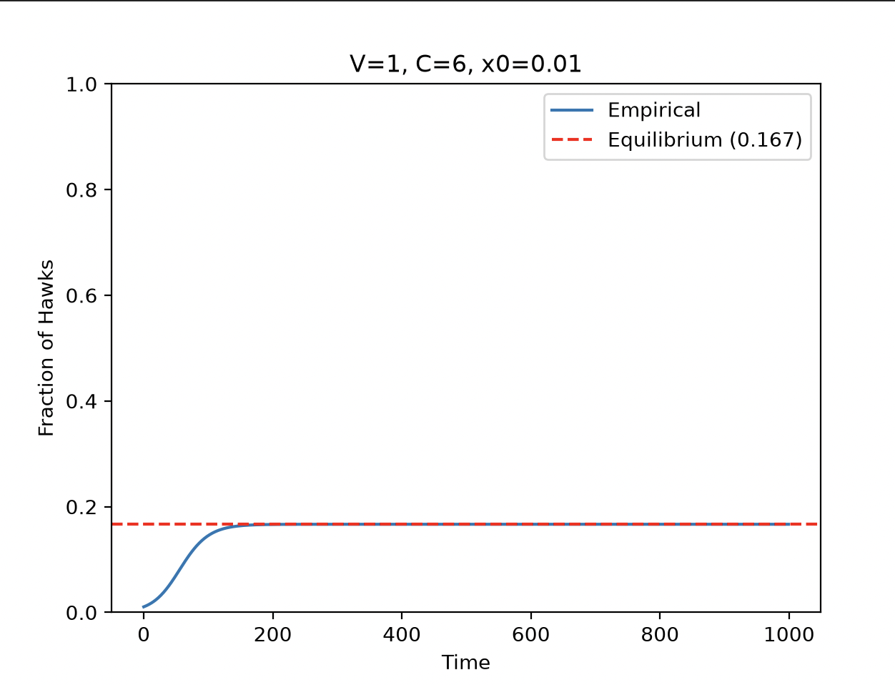
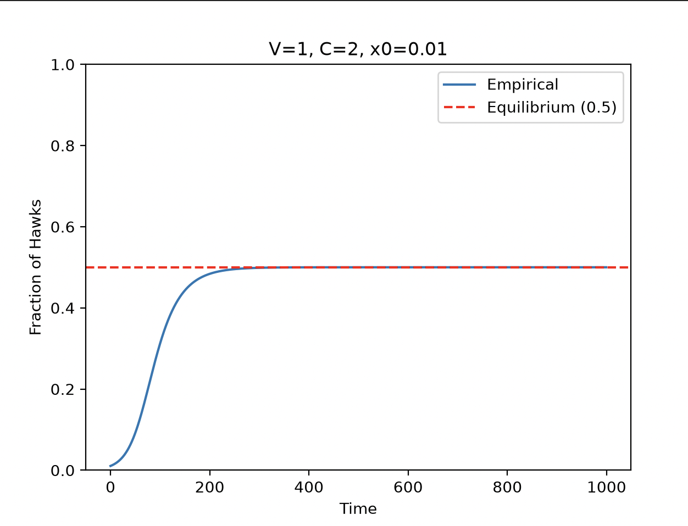
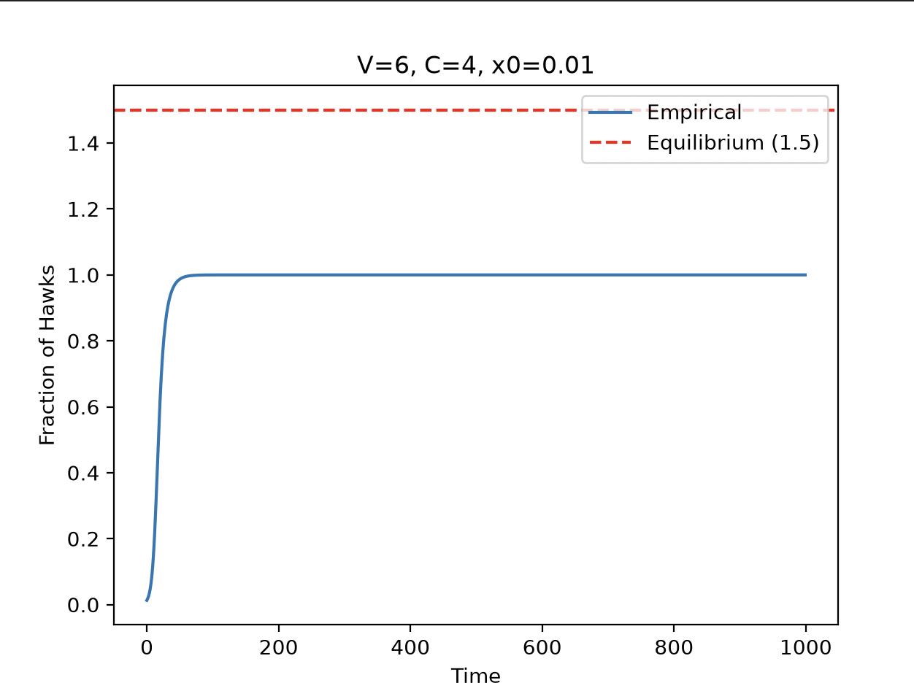
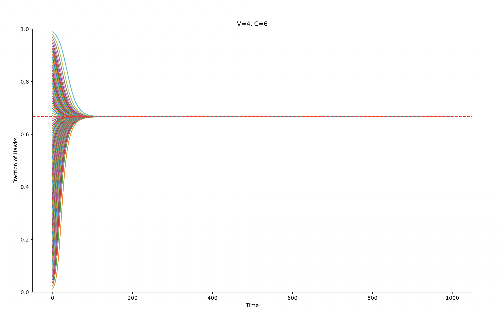

# Week 7 Project - Hawk Dove Game

## Reading
- ITCS Chapter 5 *(5.1 through 5.3)*: Evolutionary Processes

## Background

### The Replicator Equation
Many complex systems are a result of *evolutionary processes*: processes where new entities are introduced into the environment, interact with other entities/with the environment, and survive or die off based on their *fitness*.

The process of evolution can be crudely modeling with a nonlinear differential equation known as the *replicator equation*:
$$\frac{d}{dt}x_i = x_i(f_i(x)-\phi(x))$$
Where: 
- $x_i$: the fraction of the total population that is entity $i$
- $f_i(x)$: the fitness of entity $i$
- $\phi(x)$: the average fitness of all entities in the environment.

Intuitively, it's very simple. The number of entities of type $i$ will increase if their fitness is greater than average, and will decrease if it is less than average.

Such an equation can be used to approximate the outcome of a *non-zero sum game*, where certain outcomes can help or hinder both players.

### The Game
One example of a game is the "Hawk-Dove Scenario". A class game theoretic model where two classes of entities, hawks and doves, exist in an environment and compete for a collective resource $V$. 

If a hawk encounters a hawk, they each have a 50% chance of either winning or losing and paying a *conflict cost* $C$. If a hawk encounters a dove... well let's just say the dove doesn't have a fun time and the hawk wins the whole resource. If a dove encounters a dove, they split the resource 50/50.

The replicator equation can be used to determine what species will thrive in an environment based on the value of the resource $V$ and the cost of conflict $C$.

## The Project

This project is to implement the Hawk-Dove game and observe the outcome empirically.

But first, we should try and theorize what the outcome *should* be. In other words, what the final equilibrium will be.

### Calculating Equilibrium

#### Calculating Fitness

We will use $x$ to denote the fraction of hawks in the environment.

$f_h(x)$ and $f_d(x)$ are the fitnesses for the hawks and doves respectively.

The fitness of a species is its *expected payoff* during any given timestep. From the problem description earlier, the payoff matrix can be written as $$ A = \begin{bmatrix} \frac{V-C}{2} & V \\ 0 & \frac{V}{2} \end{bmatrix}$$

The expected payoff of a hawk is $(\text{probability of encountering a hawk} \times \text{payoff when encountering a hawk}) + (\text{probability of encountering a dove} \times \text{payoff when encountering a dove})$ 

The probability of a hawk encountering a hawk is just $x$, and for doves $1-x$, so: $$f_h(x) = x(\frac{V-C}{2}) + (1-x)(V)$$
With similar logic, we find that $$f_d(x) = x(0) + (1-x)(\frac{V}{2})$$ and $$\phi(x) = xf_h(x)+(1-x)f_d(x)$$

#### Equilibrium

Equilibrium is just when the fractions of each species no longer change, in other words: $\frac{d}{dt}x = 0$

From the replicator equation, we know $\frac{d}{dt}x = x(f_h(x) - \phi(x))$

$x(f_h(x) - \phi(x)) = 0$ if $x=0$ or $f_h(x) - \phi(x) = 0$

The former means that there are no hawks.

The latter can be calculated by substituting the whole values for $f_h(x) \text{ and }\phi(x)$ calculated earlier. The bulk of the algebra is left out for the sake of brevity, but it effectively simplifies into $$f_h(x)(x-1)-f_d(x)(x-1)=0$$, which means $$f_h(x) = f_d(x) \text{ (fitnesses are equal)}$$, which, when solved for x, gives $$x = V/C$$

So equilibrium is found when either:
- a. There are no hawks
- or b. The fraction of hawks equals the resource value divided by the cost of conflict ($\frac{V}{C}$)

### Empirical Demonstration

This is exactly what we find in the simulation. I've attached a few examples below showing both the change in hawk population over time, and the calculated equilibrium of $\frac{V}{C}$.

It's important and interesting to note that if $V > C$, then the hawks will completely dominate, and the calculated equilibrium will be inaccurate (since the fraction of hawks cannot exceed 1).

## Discussion

The outcome of $\frac{V}{C}$ being equilibrium makes sense. If the cost of competing is high relative to the reward, then hawks are less advantageous in the environment. Doves are rewarded for never suffering the cost of conflict.

Additionally, the [game theory solver from last week](https://github.com/drecrash/complexity-lp-cogsci/tree/main/weekly-projects/06-gametheory-solver) is useful, but not applicable to this problem because this is not a zero-sum game. Such games can only be solved with dynamic simulation or an alternative algorithm.

However, although the game theory solver cannot be applied, the concept of Nash Equilibrium absolutely still can. And it is directly observed in this game. Nash equilibrium is when both parties have no incentive to change, or in other words, *they have equal fitness*. Which is exactly what was observed when solving $x(f_h(x) - \phi(x)) = 0$.

Also, as a bonus, I've attached an image of how the dynamics of how the hawk population changes over time differs with varying initial hawk populations $x_0$. It's honestly less extreme than I expected. They all just converge to the $\frac{V}{C}$ point

### Limitations

- Population size is constant
- Can't account for changing strategies
- Assumes the probability of encountering another species is equal to the relative abundance of the species